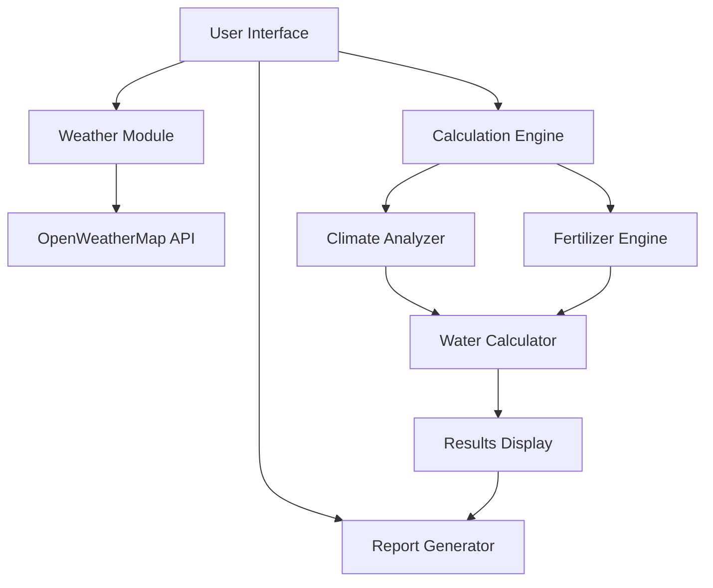

# Water Footprinting Calculator - Project Report
## किसान पानी कैलकुलेटर - परियोजना विवरण

## Table of Contents
1. [Installation Guide](#installation-guide)
2. [Project Overview](#project-overview)
3. [Technical Architecture](#technical-architecture)
4. [Implementation Details](#implementation-details)
5. [Testing Guide](#testing-guide)
6. [API Documentation](#api-documentation)
7. [User Guide](#user-guide)
8. [Future Enhancements](#future-enhancements)

## Installation Guide

### Prerequisites
- Web browser with JavaScript enabled
- Internet connection for weather API
- Text editor for modifications
- OpenWeatherMap API key

### Setup Steps
1. **Clone/Download Files**
   ```bash
   git clone <repository-url>
   # or download and extract zip file
   ```

2. **API Key Configuration**
   - Sign up at OpenWeatherMap.org
   - Get your API key
   - Replace API_KEY in Untitled-1.html:
     ```javascript
     const API_KEY = 'your-api-key-here';
     ```

3. **File Structure Setup**
   ```
   WaterFootprinting/
   ├── Untitled-1.html
   ├── compare.js
   └── report.js
   ```

4. **Local Development Server**
   - Use Python's built-in server:
     ```bash
     python -m http.server 8000
     ```
   - Or use VS Code's Live Server extension

5. **Browser Access**
   - Open http://localhost:8000/Untitled-1.html
   - Enable location services for GPS features

### Troubleshooting
- Clear browser cache if weather data doesn't load
- Check console for API errors
- Verify file permissions
- Ensure all files are in the same directory

### Project Overview
The Water Footprinting Calculator is a web-based application designed to help farmers calculate water requirements, fertilizer recommendations, and crop comparisons based on local weather conditions and agricultural best practices.

### Key Features
1. **Water Requirement Calculation**
   - Blue water (irrigation)
   - Green water (rainfall)
   - Grey water (pollution control)
   - Total water footprint per ton
   - Visual breakdown using Chart.js

2. **Weather Integration**
   - OpenWeatherMap API integration
   - City search functionality
   - GPS location detection
   - Real-time weather data including:
     - Temperature
     - Humidity
     - Wind speed
     - Monthly rainfall estimation

3. **Climate-Aware Fertilizer Recommendations**
   - NPK calculations based on crop type
   - Climate zone detection
   - Weather-based adjustments
   - Basal and top dressing schedules
   - Organic and micronutrient recommendations

4. **Crop Comparison Tool**
   - Side-by-side crop comparison
   - Water requirement analysis
   - Fertilizer requirement comparison
   - Area-based scaling
   - Yield predictions

5. **Report Generation**
   - Detailed PDF reports
   - Downloadable format
   - Complete analysis summary
   - Climate-specific recommendations

### Technical Architecture

#### System Workflows

1. **Weather Data Retrieval Flow**
   ```mermaid
   sequenceDiagram
       participant User
       participant UI
       participant WeatherAPI
       participant Calculator
       
       User->>UI: Enter city/Use GPS
       UI->>WeatherAPI: Geocoding request
       WeatherAPI-->>UI: Coordinates
       UI->>WeatherAPI: Weather data request
       WeatherAPI-->>UI: Current & forecast
       UI->>Calculator: Update weather data
       Calculator-->>UI: Update displays
   ```

2. **Calculation Workflow**
   ```mermaid
   sequenceDiagram
       participant User
       participant Calculator
       participant ClimateAnalyzer
       participant FertilizerEngine
       
       User->>Calculator: Input crop & area
       Calculator->>ClimateAnalyzer: Get climate zone
       ClimateAnalyzer-->>Calculator: Climate classification
       Calculator->>FertilizerEngine: Calculate requirements
       FertilizerEngine-->>Calculator: Adjusted recommendations
       Calculator-->>User: Display results
   ```

3. **Report Generation Flow**
   ```mermaid
   sequenceDiagram
       participant User
       participant ReportEngine
       participant DataCollector
       participant FileSystem
       
       User->>ReportEngine: Request report
       ReportEngine->>DataCollector: Gather metrics
       DataCollector-->>ReportEngine: Compiled data
       ReportEngine->>FileSystem: Generate report file
       FileSystem-->>User: Download report
   ```

#### Application Architecture



#### Code Organization
The application follows a modular architecture with clear separation of concerns:

1. **Core Modules**
   - Weather handling (API integration)
   - Calculations (water, fertilizer)
   - Climate analysis
   - Report generation

2. **UI Components**
   - Input forms
   - Results display
   - Interactive elements
   - Modal windows

3. **Data Management**
   - Crop database
   - Weather cache
   - Configuration constants

#### File Structure
```
WaterFootprinting/
├── Untitled-1.html      # Main application file
├── compare.js           # Crop comparison functionality
└── report.js           # Report generation module
```

#### Technologies Used
- **Frontend**: HTML5, CSS3, JavaScript
- **Charting**: Chart.js v3.9.1
- **Weather API**: OpenWeatherMap API
- **Geolocation**: Browser Geolocation API
- **Layout**: CSS Grid/Flexbox
- **Animations**: CSS Keyframes

### Database Structure

#### Crop Database
The application maintains a comprehensive crop database with the following parameters for each crop:

```javascript
cropDatabase = {
    cropName: {
        kc: number,              // Crop coefficient
        growingDays: number,     // Growing period
        green: number,           // Green water requirement
        grey: number,           // Grey water requirement
        baseYield: number,      // Expected base yield
        fertilizer: {
            n: number,          // Nitrogen requirement
            p: number,          // Phosphorus requirement
            k: number,          // Potassium requirement
            basal: {
                urea: number,
                dap: number,
                mop: number
            },
            top1: {
                urea: number,
                days: number,
                stage: string
            },
            top2: {
                urea: number,
                days: number,
                stage: string
            },
            organic: string,
            micronutrients: string
        }
    }
}
```

### Calculation Models

#### 1. Water Footprint Calculation
```javascript
blueWaterPerTon = (totalIrrigationMM * 10) / actualYield / efficiency
totalWaterFootprint = blue + green + grey
```

#### 2. Climate Classification
```javascript
if (temp >= 28 && humidity > 60) return 'tropical'
if (temp >= 25 && humidity < 40) return 'arid'
if (temp >= 20 && temp < 28 && humidity >= 40 && humidity <= 70) return 'temperate'
if (temp < 15) return 'continental'
return 'mediterranean'
```

#### 3. Fertilizer Adjustments
Base adjustments by climate:
- Tropical: N reduced 15%, basal/top reduced 5-10%
- Arid: K increased 20%, basal/top increased 5-10%
- Continental: N reduced 10%, K reduced 5%
- Mediterranean: N reduced 5%

Additional adjustments:
- Heavy rainfall (>200mm/month): N reduced 15%
- Low rainfall (<30mm/month): K increased 5%
- High temperature (>32°C): K increased 5%
- Low temperature (<8°C): N reduced 10%

### User Interface Design

#### Layout Components
1. **Header Section**
   - Title in Hindi and English
   - Animated water droplet effect

2. **Location Section**
   - City input field
   - GPS detection option
   - Weather information display

3. **Crop Input Section**
   - Crop selection dropdown
   - Area input
   - Irrigation method selection
   - Expected yield input

4. **Results Display**
   - Water requirement boxes
   - Doughnut chart visualization
   - Total water need summary

5. **Fertilizer Recommendations**
   - NPK requirements
   - Application schedule
   - Climate-based adjustments
   - Organic recommendations

6. **Comparison Section**
   - Dual crop selection
   - Area inputs
   - Side-by-side comparison

### Implementation Details

#### 1. Weather Data Integration
```javascript
async function fetchWeather(query) {
    // City to coordinates
    const geoUrl = `https://api.openweathermap.org/geo/1.0/direct?q=${query}&limit=1&appid=${API_KEY}`;
    
    // Current weather and forecast
    const currentUrl = `${WEATHER_BASE_URL}/weather?lat=${lat}&lon=${lon}&appid=${API_KEY}&units=metric`;
    const forecastUrl = `${WEATHER_BASE_URL}/forecast?lat=${lat}&lon=${lon}&appid=${API_KEY}&units=metric`;
    
    // Calculate monthly rainfall from 5-day forecast
    const estimatedMonthlyRainfall = Math.round((totalRainfall / 5) * 30);
}
```

#### 2. ET0 Calculation (Simplified Penman-Monteith)
```javascript
function calculateET0(temp, humidity, windSpeed, lat) {
    const es = 0.6108 * Math.exp((17.27 * T) / (T + 237.3));
    const ea = es * (RH / 100);
    const delta = (4098 * es) / Math.pow(T + 237.3, 2);
    const gamma = 0.067;
    // ... additional calculations
}
```

## API Documentation

### OpenWeatherMap API Integration

1. **Geocoding API**
   ```javascript
   GET https://api.openweathermap.org/geo/1.0/direct
   Parameters:
   - q: City name
   - limit: 1
   - appid: API key
   ```

2. **Current Weather API**
   ```javascript
   GET https://api.openweathermap.org/data/2.5/weather
   Parameters:
   - lat: Latitude
   - lon: Longitude
   - units: metric
   - appid: API key
   ```

3. **Forecast API**
   ```javascript
   GET https://api.openweathermap.org/data/2.5/forecast
   Parameters:
   - lat: Latitude
   - lon: Longitude
   - units: metric
   - appid: API key
   ```

### Internal API Methods

1. **Climate Analysis**
   ```javascript
   determineClimate(temp, humidity)
   Returns: 'tropical' | 'arid' | 'temperate' | 'continental' | 'mediterranean'
   ```

2. **Water Calculations**
   ```javascript
   calculateET0(temp, humidity, windSpeed, lat)
   Returns: number // Reference evapotranspiration
   ```

3. **Fertilizer Calculations**
   ```javascript
   computeFertilizerData(crop, area, climate)
   Returns: {
       nPerHa: number,
       pPerHa: number,
       kPerHa: number,
       basalUrea: number,
       basalDAP: number,
       basalMOP: number,
       adj: object
   }
   ```

### Error Handling

1. **Weather API Errors**
   ```javascript
   try {
       const response = await fetch(url);
       if (!response.ok) throw new Error('Weather data fetch failed');
   } catch (error) {
       console.error('API Error:', error);
       alert('Error: ' + error.message);
   }
   ```

2. **Validation Errors**
   ```javascript
   if (!crop) {
       alert('कृपया फसल चुनें / Please select a crop');
       return;
   }
   ```

### Testing Guide

#### 1. Unit Testing Focus Areas

1. **Weather Integration Testing**
   - Valid city names
   - Invalid city names
   - GPS coordinates
   - API response handling
   - Error message display

2. **Calculation Verification**
   - Water footprint calculations
   - Fertilizer adjustments
   - Climate classification
   - Area scaling
   - Unit conversions

3. **UI/UX Testing**
   - Responsive design
   - Form validation
   - Button states
   - Loading indicators
   - Error messages
   - Modal displays

### Future Enhancements

1. **Data & Analytics**
   - Historical data tracking
   - Trend analysis
   - Seasonal recommendations
   - Yield optimization suggestions

2. **User Features**
   - User accounts
   - Saved calculations
   - Custom crop additions
   - Multi-language support
   - Offline functionality

3. **Technical Improvements**
   - PWA implementation
   - Caching strategy
   - Performance optimization
   - Database integration
   - API versioning

## User Guide

### Getting Started

1. **Location Setup**
   - Enter city name OR
   - Click GPS button
   - Wait for weather data to load
   - Verify weather card appears

2. **Crop Information**
   - Select crop type
   - Enter land area (hectares)
   - Choose irrigation method:
     - Drip (90% efficiency)
     - Sprinkler (75% efficiency)
     - Traditional (60% efficiency)
   - Input expected yield (optional)

3. **Calculations**
   - Click "Calculate Water"
   - Review water footprint:
     - Blue (irrigation)
     - Green (rainfall)
     - Grey (pollution)
   - Check fertilizer recommendations

4. **Comparing Crops**
   - Select two crops
   - Enter areas
   - Click "Compare"
   - Review side-by-side analysis

5. **Reports**
   - Calculate water first
   - Click "Generate Report"
   - Review in modal
   - Download if needed

### Understanding Results

1. **Water Footprint Components**
   - Blue Water: Direct irrigation needs
   - Green Water: Effective rainfall
   - Grey Water: Water needed for diluting pollutants

2. **Fertilizer Recommendations**
   - Base NPK requirements
   - Climate adjustments
   - Application timing
   - Special considerations

3. **Climate Effects**
   - Tropical: Higher rainfall adjustments
   - Arid: Drought tolerance focus
   - Continental: Temperature adaptations
   - Mediterranean: Seasonal considerations

### Best Practices

1. **For Accuracy**
   - Use current location
   - Update weather regularly
   - Input actual area
   - Consider local conditions

2. **For Efficiency**
   - Compare similar crops
   - Review multiple scenarios
   - Save important reports
   - Monitor seasonal changes

### Troubleshooting

1. **Weather Issues**
   - Verify internet connection
   - Check city spelling
   - Allow GPS permissions
   - Refresh page if needed

2. **Calculation Problems**
   - Verify all inputs
   - Check area units
   - Ensure crop selected
   - Review irrigation method

### Conclusion

The Water Footprinting Calculator provides a comprehensive solution for farmers to:
- Calculate water requirements
- Receive climate-aware fertilizer recommendations
- Compare different crops
- Generate detailed reports
- Make informed agricultural decisions

The modular architecture allows for easy maintenance and future enhancements, while the intuitive UI ensures accessibility for users with varying technical expertise.

### Acknowledgments

- OpenWeatherMap API for weather data
- Chart.js for visualizations
- Agricultural research papers for crop coefficients
- Farmer feedback for UI/UX improvements

---

Report generated: October 30, 2025
Project Version: 1.0.0